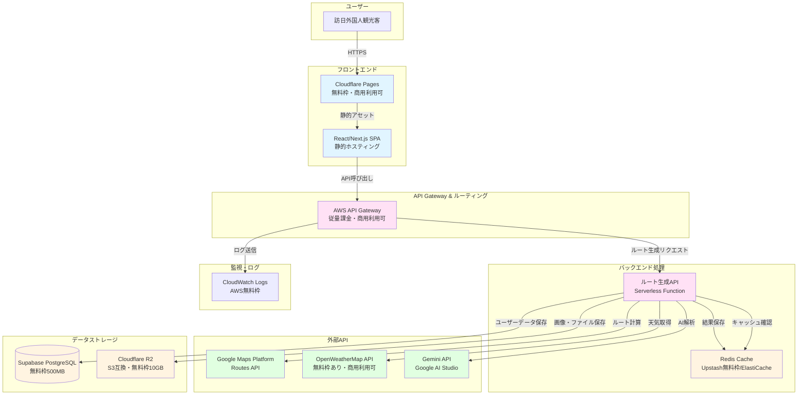
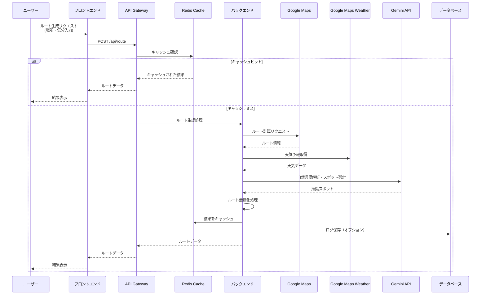
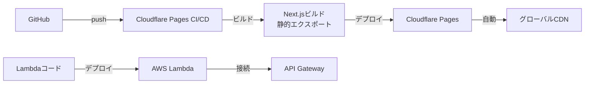

# Itineos サービス構成図

## アーキテクチャ概要

運用費用を最小化するためのサーバーレス中心の構成です。



## コンポーネント詳細

### 1. フロントエンド

- **技術スタック**: Next.js (React) + TypeScript（静的エクスポート）
- **ホスティング**: Cloudflare Pages（商用利用可）
  - 無料枠: 無制限帯域幅、500 ビルド/月
  - 自動デプロイ（GitHub 連携）
  - グローバル CDN 統合
  - HTTPS 証明書自動管理
  - 商用利用可
- **代替案**: AWS Amplify（無料枠あり、商用利用可）

### 2. バックエンド API

- **技術スタック**: Node.js
- **ホスティング**: AWS Lambda + API Gateway（商用利用可）
  - AWS Lambda: 無料枠 100 万リクエスト/月
  - API Gateway: 無料枠 100 万リクエスト/月（最初の 12 ヶ月）
  - 使用時のみ課金（リクエスト数ベース）
  - 自動スケーリング
  - コールドスタート対策: プロビジョンド同時実行数の最小化
- **代替案**: Cloudflare Workers（無料枠 10 万リクエスト/日、商用利用可）

### 3. キャッシュ層

- **Redis**: AWS ElastiCache for Redis または Upstash Serverless Redis
  - **AWS ElastiCache**: 従量課金（t3.micro インスタンス: 約 $12/月）
  - **Upstash**: 無料枠 10K コマンド/日（商用利用可）
  - ルート計算結果のキャッシュ（1 時間 TTL）
  - 天気データのキャッシュ（1 時間 TTL）
  - API 呼び出し回数の削減でコスト削減
- **初期段階**: Upstash 無料枠で開始、トラフィック増加時に ElastiCache 検討

### 4. データベース

- **PostgreSQL**: Supabase（無料枠）
  - 500MB まで無料
  - 認証機能も無料枠で利用可能
  - バックアップ自動
  - 代替案: Neon Serverless PostgreSQL（無料枠あり）

**保存データ例**:

- ユーザー情報（最小限、認証が必要な場合のみ）
- 生成されたルート履歴（統計用、短期保存）
- お気に入りスポット（ユーザー機能がある場合）

### 5. オブジェクトストレージ

- **Cloudflare R2** または **AWS S3**
  - Cloudflare R2: 無料枠 10GB、アウトバウンド無料
  - S3: 最初の 5GB 無料
  - 使用用途: ユーザーアップロード画像、静的アセット

### 6. 外部 API 統合

#### Google Maps Platform (Routes API)

- **用途**: ルート計算、移動時間算出
- **コスト**: リクエストベース課金
- **最適化**: キャッシュで重複リクエスト削減

#### Google Maps Weather API

- **用途**: 天気予報データ取得（Google Maps Platform の Weather 機能を利用）
- **コスト**: Google Maps Platform の課金体系に依存（リクエストベース）
  - **最適化**: キャッシュで頻繁な呼び出しを防止
  - **代替案**: OpenWeatherMap、WeatherAPI.com など

#### Gemini API (Google AI Studio)

- **用途**: 自然言語要望の解析、スポット選定
- **コスト**: リクエストベース課金（無料枠あり）
- **最適化**: プロンプト最適化、キャッシュ活用

## データフロー



## コスト最適化のポイント

### 1. サーバーレス構成

- **常時起動サーバー不要**: 使用時のみ課金
- **自動スケーリング**: トラフィック増加に対応
- **メンテナンス不要**: インフラ管理が最小限

### 2. キャッシュ戦略

- **Redis キャッシュ**: 同一条件のリクエストをキャッシュ
- **TTL 設定**: 1 時間程度のキャッシュで API 呼び出し削減
- **CDN キャッシュ**: 静的アセットは CDN で配信

### 3. 無料枠の活用

- **Cloudflare Pages**: 無料枠で無制限帯域幅（商用利用可）
- **AWS Lambda**: 無料枠 100 万リクエスト/月
- **AWS API Gateway**: 無料枠 100 万リクエスト/月（最初の 12 ヶ月）
- **Supabase/Neon**: データベース無料枠（商用利用可）
- **Cloudflare R2**: オブジェクトストレージ無料枠（商用利用可）
  - **Google Maps Weather API**: Google Maps Platform の料金に従う（リクエストベース）

### 4. API 呼び出し最適化

- **バッチ処理**: 可能な限り複数の情報をまとめて取得
- **リクエスト削減**: キャッシュで重複呼び出しを防止
- **エラーハンドリング**: リトライロジックで無駄な呼び出しを防止

### 5. データ保存の最小化

- **短期保存**: ルート履歴は一定期間後に削除
- **集計データ**: 統計が必要な場合は集計後のみ保存
- **NoSQL 代替**: シンプルなデータ構造なら KV ストアで対応

## 予想される月額コスト（初期段階）

| サービス            | 無料枠                         | 予想コスト                   |
| ------------------- | ------------------------------ | ---------------------------- |
| Cloudflare Pages    | 無制限帯域幅                   | ¥0                           |
| AWS Lambda          | 100 万リクエスト/月            | ¥0（小規模利用時）           |
| AWS API Gateway     | 100 万リクエスト/月（12 ヶ月） | ¥0-500（初期段階）           |
| Supabase            | 500MB DB                       | ¥0                           |
| Cloudflare R2       | 10GB                           | ¥0                           |
| Google Maps API     | 無料枠あり                     | ¥1,000-3,000（使用量による） |
| Gemini API          | 無料枠あり                     | ¥500-2,000（使用量による）   |
| OpenWeatherMap API  | 1,000 コール/日                | ¥0-1,000（使用量による）     |
| Upstash Redis       | 10K コマンド/日                | ¥0（小規模利用時）           |
| AWS CloudWatch Logs | 5GB ログ/月                    | ¥0（小規模利用時）           |
| **合計**            | -                              | **¥1,500-6,500/月**          |

※ トラフィック増加に応じてスケール

## スケーラビリティ

### 初期段階（0-1,000 ユーザー/月）

- 無料枠で十分対応可能
- サーバーレスで自動スケール

### 成長段階（1,000-10,000 ユーザー/月）

- Cloudflare Pages は無料枠で継続利用可能
- API Gateway の従量課金が増加（¥2,000-5,000/月程度）
- データベース容量拡張
- キャッシュ層の強化（ElastiCache への移行検討）
- OpenWeatherMap 有料プラン検討（¥6,000/月程度）

### 拡大段階（10,000+ユーザー/月）

- AWS Lambda + API Gateway への移行検討
- RDS/ElastiCache の導入
- 専用 CDN（CloudFront）の検討

## セキュリティ対策

- **HTTPS**: Cloudflare Pages で自動対応
- **API 認証**: Supabase Auth（無料枠）または JWT
- **レート制限**: API Gateway のレート制限機能で実装
- **環境変数**: AWS Systems Manager Parameter Store または Secrets Manager で API キー管理
- **CORS 設定**: API Gateway で適切なオリジン制限
- **WAF**: Cloudflare の無料 WAF 機能を活用

## デプロイフロー



- **フロントエンド**: GitHub に push すると Cloudflare Pages が自動デプロイ
- **バックエンド**: AWS SAM / Serverless Framework で Lambda 関数をデプロイ
- プレビューデプロイも自動生成
- ロールバック機能あり

## 構成管理（Infrastructure as Code）

### 全体構成管理の推奨アプローチ

#### **ハイブリッドアプローチ（推奨）**

各サービスの特性に合わせて最適なツールを使い分けます。

### 構成管理戦略

#### 1. **AWS リソース**: AWS SAM または Terraform

**対象リソース**:

- AWS Lambda
- API Gateway
- CloudWatch Logs
- (将来) ElastiCache
- (将来) S3

**推奨**: **AWS SAM**（サーバーレス中心のため）

```yaml
# infrastructure/aws/template.yaml
AWSTemplateFormatVersion: "2010-09-09"
Transform: AWS::Serverless-2016-10-31

Resources:
  RouteGenerationFunction:
    Type: AWS::Serverless::Function
    Properties:
      CodeUri: ../../backend/src/
      Handler: index.handler
      Runtime: nodejs20.x
      Events:
        RouteApi:
          Type: Api
          Properties:
            Path: /api/route
            Method: post
      Logging:
        LogGroup: !Ref RouteGenerationLogGroup
      Environment:
        Variables:
          UPSTASH_REDIS_URL: !Ref UpstashRedisUrl
          SUPABASE_URL: !Ref SupabaseUrl
```

#### 2. **Cloudflare リソース**: Terraform または Cloudflare API

**対象リソース**:

- Cloudflare Pages（設定のみ、デプロイは自動）
- Cloudflare R2 バケット
- Cloudflare WAF ルール（セキュリティ対策）

**推奨**: **Terraform**（Cloudflare Provider が充実）

```hcl
# infrastructure/cloudflare/main.tf
terraform {
  required_providers {
    cloudflare = {
      source  = "cloudflare/cloudflare"
      version = "~> 4.0"
    }
  }
}

resource "cloudflare_r2_bucket" "itineos_storage" {
  account_id = var.cloudflare_account_id
  name       = "itineos-storage"
  location   = "apac"
}

resource "cloudflare_pages_project" "itineos_frontend" {
  account_id = var.cloudflare_account_id
  name       = "itineos"

  production_branch = "main"

  build_config {
    build_command   = "npm run build"
    destination_dir = "out"
  }
}
```

#### 3. **マネージドサービス**: 手動設定 + ドキュメント化

**対象リソース**:

- Supabase（PostgreSQL）
- Upstash（Redis）

**理由**: これらは SaaS で、Terraform プロバイダーはあるものの、初期段階では手動設定で十分。設定はドキュメント化。

#### 4. **外部 API キー管理**: AWS Systems Manager Parameter Store

**対象**:

- Google Maps API キー
- OpenWeatherMap API キー
- Gemini API キー

**推奨**: AWS SAM/Terraform で Parameter Store を定義

```yaml
# AWS SAM での定義例
Resources:
  MapsApiKey:
    Type: AWS::SSM::Parameter
    Properties:
      Name: /itineos/api-keys/google-maps
      Type: SecureString
      Value: !Ref MapsApiKeyValue
```

### 推奨ディレクトリ構成

```
itineos/
├── frontend/                    # Next.js アプリケーション
│   ├── src/
│   ├── package.json
│   └── next.config.js
│
├── backend/                     # Lambda 関数コード
│   ├── src/
│   │   └── index.js
│   └── package.json
│
├── infrastructure/              # 構成管理コード
│   ├── aws/
│   │   ├── template.yaml       # AWS SAM テンプレート
│   │   ├── samconfig.toml      # SAM 設定
│   │   └── parameters.json     # 環境別パラメータ
│   │
│   ├── cloudflare/
│   │   ├── main.tf             # Terraform メイン
│   │   ├── variables.tf
│   │   ├── outputs.tf
│   │   └── terraform.tfstate   # 状態ファイル（Git管理外）
│   │
│   └── docs/
│       ├── supabase-setup.md   # Supabase 手動設定手順
│       └── upstash-setup.md    # Upstash 手動設定手順
│
├── .github/
│   └── workflows/
│       ├── deploy-frontend.yml # Cloudflare Pages 自動デプロイ
│       ├── deploy-backend.yml  # AWS SAM デプロイ
│       └── deploy-infra.yml    # Terraform 適用
│
└── README.md
```

### 統合管理の選択肢

#### オプション A: **Terraform で統一管理**（中規模以上向け）

**メリット**:

- 単一ツールで統一
- 状態管理が一元化
- マルチクラウド対応

**デメリット**:

- AWS サーバーレスは SAM より冗長
- 学習コストがやや高い

```hcl
# infrastructure/terraform/main.tf
terraform {
  required_providers {
    aws = {
      source  = "hashicorp/aws"
      version = "~> 5.0"
    }
    cloudflare = {
      source  = "cloudflare/cloudflare"
      version = "~> 4.0"
    }
  }
}

# AWS リソース
module "aws_backend" {
  source = "./modules/aws"
  # ...
}

# Cloudflare リソース
module "cloudflare_frontend" {
  source = "./modules/cloudflare"
  # ...
}
```

#### オプション B: **Pulumi で統一管理**（TypeScript/Python で管理したい場合）

**メリット**:

- プログラミング言語で記述
- 型安全性
- マルチクラウド対応

**デメリット**:

- 有料プランあり（無料枠あり）
- コミュニティが Terraform より小規模

```typescript
// infrastructure/pulumi/index.ts
import * as aws from "@pulumi/aws";
import * as cloudflare from "@pulumi/cloudflare";

// AWS Lambda
const routeFunction = new aws.lambda.Function("routeGeneration", {
  // ...
});

// Cloudflare R2
const bucket = new cloudflare.R2Bucket("itineos-storage", {
  // ...
});
```

### 最終推奨

#### 初期段階（0-1,000 ユーザー/月）

**ハイブリッドアプローチ**:

1. **AWS**: AWS SAM（サーバーレスに最適）
2. **Cloudflare**: Terraform（R2 バケット設定のみ）
3. **Supabase/Upstash**: 手動設定 + ドキュメント化

**理由**:

- 各ツールの強みを活かせる
- 学習コストが低い
- 初期コストが低い

#### 成長段階（1,000-10,000 ユーザー/月）

**Terraform への移行を検討**:

- リソースが増えてきたら Terraform で統一
- 状態管理の一元化
- チーム開発での一貫性向上

### CI/CD パイプライン例

```yaml
# .github/workflows/deploy.yml
name: Deploy Infrastructure

on:
  push:
    branches: [main]

jobs:
  deploy-aws:
    runs-on: ubuntu-latest
    steps:
      - uses: actions/checkout@v3
      - uses: actions/setup-node@v3
      - name: Deploy AWS resources
        run: |
          cd infrastructure/aws
          sam build
          sam deploy --no-confirm-changeset

  deploy-cloudflare:
    runs-on: ubuntu-latest
    steps:
      - uses: actions/checkout@v3
      - name: Deploy Cloudflare resources
        run: |
          cd infrastructure/cloudflare
          terraform init
          terraform plan
          terraform apply -auto-approve
```

## 商用利用について

本構成で使用しているサービスはすべて**商用利用可能**です：

- ✅ **Cloudflare Pages**: 商用利用可、無料枠あり
- ✅ **AWS Lambda / API Gateway**: 商用利用可、無料枠あり
- ✅ **Supabase**: 商用利用可、無料枠あり
- ✅ **Cloudflare R2**: 商用利用可、無料枠あり
- ✅ **OpenWeatherMap API**: 商用利用可、無料枠あり
- ✅ **Upstash Redis**: 商用利用可、無料枠あり
